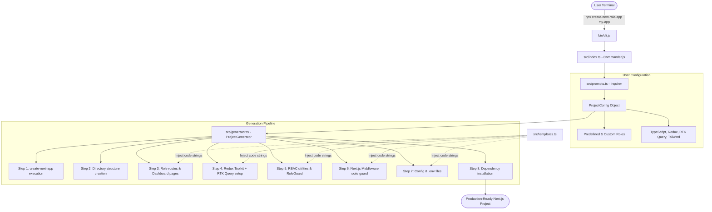
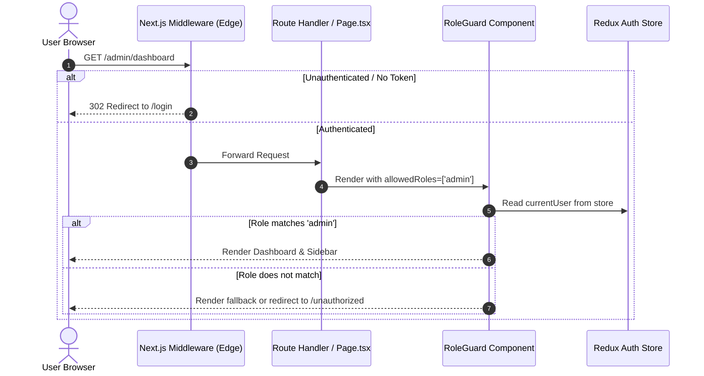

# 📖 Technical Architecture & Working Procedure Guide

> **Package:** `create-next-role-app`  
> **Type:** CLI Scaffolding Tool for Role-Based Next.js Applications  
> **Last Updated:** 2026-10-07

---

## 📑 Table of Contents

1. [Introduction & Purpose](#1-introduction--purpose)
2. [High-Level Architecture Overview](#2-high-level-architecture-overview)
3. [CLI Lifecycle & Execution Pipeline](#3-cli-lifecycle--execution-pipeline)
   - [Phase 1: CLI Entry & Flag Parsing](#phase-1-cli-entry--flag-parsing)
   - [Phase 2: Interactive Prompt Collection](#phase-2-interactive-prompt-collection)
   - [Phase 3: Configuration Normalization](#phase-3-configuration-normalization)
   - [Phase 4: The 8-Step Generation Engine](#phase-4-the-8-step-generation-engine)
4. [Deep Dive: The 8 Generation Steps](#4-deep-dive-the-8-generation-steps)
   - [Step 1: Next.js Foundation Scaffolding](#step-1-nextjs-foundation-scaffolding)
   - [Step 2: Directory Skeleton Preparation](#step-2-directory-skeleton-preparation)
   - [Step 3: Role-Based App Router Hierarchy](#step-3-role-based-app-router-hierarchy)
   - [Step 4: Redux Toolkit & RTK Query Wiring](#step-4-redux-toolkit--rtk-query-wiring)
   - [Step 5: RBAC Engine, Types & Guard Components](#step-5-rbac-engine-types--guard-components)
   - [Step 6: Edge Middleware Route Protection](#step-6-edge-middleware-route-protection)
   - [Step 7: Project Configuration & Environment Variables](#step-7-project-configuration--environment-variables)
   - [Step 8: Dependency Resolution & Finalization](#step-8-dependency-resolution--finalization)
5. [Generated Application Runtime Architecture](#5-generated-application-runtime-architecture)
   - [Authentication & Role Resolution Flow](#authentication--role-resolution-flow)
   - [Client-Side Protection with RoleGuard & useAuth](#client-side-protection-with-roleguard--useauth)
   - [API Data Layer Architecture with RTK Query](#api-data-layer-architecture-with-rtk-query)
6. [Practical Working Procedures for Developers](#6-practical-working-procedures-for-developers)
   - [Procedure A: Scaffolding a New Application](#procedure-a-scaffolding-a-new-application)
   - [Procedure B: Connecting Real Backend Authentication](#procedure-b-connecting-real-backend-authentication)
   - [Procedure C: Adding New Roles & Protected Routes](#procedure-c-adding-new-roles--protected-routes)
   - [Procedure D: Creating New RTK Query Endpoints](#procedure-d-creating-new-rtk-query-endpoints)
7. [CLI Package Development & Maintenance Workflow](#7-cli-package-development--maintenance-workflow)
   - [Local Environment Setup](#local-environment-setup)
   - [Build Pipeline with tsup](#build-pipeline-with-tsup)
   - [Local Testing & Linking](#local-testing--linking)
   - [NPM Publishing Procedure](#npm-publishing-procedure)

---

## 1. Introduction & Purpose

`create-next-role-app` is an enterprise-grade CLI generator designed to solve the repetitive, boilerplate-heavy setup of Role-Based Access Control (RBAC) in modern Next.js applications (App Router).

### Key Problems Solved:
- **Scattered Route Hierarchies:** Manually structuring folder groups `(dashboard)/admin`, `(dashboard)/customer`, etc.
- **Boilerplate Fatigue:** Setting up Redux store, typed hooks, client providers, and RTK Query base APIs across multiple files.
- **Inconsistent RBAC Logic:** Inconsistent checks like `user.role === 'admin'` spread across components without type safety or centralized permission helpers.
- **Incomplete Middleware Protection:** Complex Next.js Edge Middleware route guards written from scratch without predefined role mappings.

---

## 2. High-Level Architecture Overview

The following diagram illustrates how the CLI operates from terminal execution to a fully ready Next.js project:



---

## 3. CLI Lifecycle & Execution Pipeline

### Phase 1: CLI Entry & Flag Parsing
1. **Entrypoint (`bin/cli.js`):**
   - Has shebang `#!/usr/bin/env node`.
   - Requires `../dist/index.js` (built CommonJS bundle produced by `tsup`).
2. **Commander (`src/index.ts`):**
   - Configures CLI version, descriptions, and positional argument `[project-name]`.
   - If an argument is provided (e.g. `npx create-next-role-app erp-portal`), it is captured into `options.projectName`.

### Phase 2: Interactive Prompt Collection
If arguments are omitted or require confirmation, `src/prompts.ts` kicks off using `@inquirer/prompts`:
- **Project Name:** Validates non-empty input and folder name conventions.
- **Predefined Roles Selection:** Checkbox prompt offering `admin`, `customer`, `worker`, `manager`, `vendor`, `editor`, `moderator`.
- **Custom Roles:** Allows typing arbitrary comma-separated role names (e.g. `doctor, nurse, receptionist`).
- **Feature Toggles:**
  - `typescript` (default: `true`)
  - `redux` (default: `true`)
  - `rtkQuery` (default: `true` if Redux is enabled)
  - `tailwind` (default: `true`)

### Phase 3: Configuration Normalization
All inputs are consolidated into a strongly typed `ProjectConfig` object:

```typescript
interface ProjectConfig {
  projectName: string;
  roles: string[];           // Selected predefined roles
  customRoles: string[];     // User-entered custom roles
  typescript: boolean;
  redux: boolean;
  rtkQuery: boolean;
  tailwind: boolean;
}
```

### Phase 4: The 8-Step Generation Engine
An instance of `ProjectGenerator` is instantiated and `generator.generate()` executes sequential asynchronous steps with visual spinners powered by `ora` and colored terminal feedback powered by `chalk`.

---

## 4. Deep Dive: The 8 Generation Steps

### Step 1: Next.js Foundation Scaffolding
- **Target:** Root directory `${process.cwd()}/${projectName}`.
- **Safety Check:** Verifies if the target folder exists. If already present, execution halts immediately with a descriptive error.
- **Execution:** Spawns `npx -y create-next-app@latest` with automated flags:
  ```bash
  npx -y create-next-app@latest <projectName> \
    --app \
    --src-dir=false \
    --import-alias=@/* \
    --eslint \
    --no-turbopack \
    --typescript (or --no-typescript) \
    --tailwind (or --no-tailwind)
  ```

### Step 2: Directory Skeleton Preparation
Ensures a pristine structure adhering to Next.js App Router best practices using `fs-extra`:
- `components/` (Shared UI components like `RoleGuard`)
- `features/auth/` (Auth slice and state logic)
- `features/user/` (Domain-specific feature logic)
- `lib/auth/` (RBAC utilities)
- `lib/redux/` & `lib/redux/api/` (Store, hooks, base API)
- `constants/` (Role constants)
- `types/` (TypeScript interfaces)
- `hooks/` (Custom React hooks)
- `app/(auth)/login/`, `app/(auth)/register/` (Auth route group)
- `app/(dashboard)/` (Protected dashboard group)
- `app/unauthorized/` (HTTP 403 Access Denied page)

### Step 3: Role-Based App Router Hierarchy
For every active role (predefined + custom):
1. **Dynamic Dashboard Path:** `app/(dashboard)/<role>/dashboard/page.tsx`
   - Generates an analytical dashboard with KPI metrics, header, and sidebar navigation.
2. **Sub-Route Generation:**
   - Predefined roles get tailored sub-routes (e.g. `admin` gets `users`, `settings`, `analytics`; `customer` gets `orders`, `profile`, `support`).
   - Custom roles receive default sensible sub-routes (`tasks`, `reports`, `settings`).
3. **App Router Layouts & Pages Overwrite:**
   - `app/(dashboard)/layout.tsx`: Wraps dashboard sub-pages.
   - `app/(auth)/layout.tsx`: Centered auth container.
   - `app/(auth)/login/page.tsx`: Glassmorphism login UI.
   - `app/(auth)/register/page.tsx`: Registration form.
   - `app/unauthorized/page.tsx`: 403 Forbidden screen.
   - `app/layout.tsx`: Wraps app with `ReduxProvider` and font setup.
   - `app/page.tsx`: Landing page with direct links to all active role dashboards.
   - `app/globals.css`: Dark-mode glassmorphic styling system.

### Step 4: Redux Toolkit & RTK Query Wiring
When Redux is enabled:
- **`lib/redux/store.ts`:** Creates configured Redux store with `authReducer` and RTK Query middleware.
- **`lib/redux/hooks.ts`:** Exports typed hooks `useAppDispatch` and `useAppSelector`.
- **`lib/redux/provider.tsx`:** Client-component wrapper (`"use client"`) providing the store.
- **`lib/redux/api/baseApi.ts`:** Central RTK Query API service configured with `fetchBaseQuery`, automatic authorization header injection, and cache tags (`User`, `Auth`).
- **`features/auth/authSlice.ts`:** Manages authenticated `user`, `token`, `isAuthenticated`, and reducer actions (`setCredentials`, `logout`, `updateUser`).

### Step 5: RBAC Engine, Types & Guard Components
- **`constants/roles.ts`:** Contains immutable dictionary `ROLES` and union type `Role`.
- **`types/auth.ts`:** Full TypeScript contracts (`User`, `AuthResponse`, `LoginCredentials`).
- **`lib/auth/permissions.ts`:** Pure helper functions:
  - `hasRole(userRoles, role)`
  - `hasAnyRole(userRoles, allowedRoles)`
  - `hasAllRoles(userRoles, requiredRoles)`
  - `getHighestRole(userRoles, hierarchy)`
  - `getRoleRedirectPath(role)`
- **`components/RoleGuard.tsx`:** Declarative React component to hide/show UI based on permissions:
  ```tsx
  <RoleGuard allowedRoles={[ROLES.ADMIN]} fallback={<Forbidden />}>
    <AdminContent />
  </RoleGuard>
  ```
- **`hooks/useAuth.ts`:** Clean ergonomic hook exposing `user`, `isAuthenticated`, `checkRole()`, `checkAnyRole()`, `login()`, `logout()`.

### Step 6: Edge Middleware Route Protection
- **`middleware.ts`:** Intercepts incoming requests at the Next.js Edge layer.
- Compares `request.nextUrl.pathname` against registered role route prefixes (`/admin`, `/customer`, `/worker`, etc.).
- Outlines clear hook points for reading auth tokens/cookies and redirecting unauthorized visitors to `/login` or `/unauthorized`.

### Step 7: Project Configuration & Environment Variables
- **`role-app.config.ts`:** Project-wide metadata file maintaining configured roles, default fallback paths, and enabled feature switches.
- **`.env.example` & `.env.local`:** Pre-filled environment variable templates (`NEXT_PUBLIC_API_URL`, `NEXT_PUBLIC_APP_NAME`, `JWT_SECRET`).

### Step 8: Dependency Resolution & Finalization
- Dynamically executes `npm install @reduxjs/toolkit react-redux` inside the newly scaffolded project directory.
- Prints a clean success summary with commands to run and direct URLs for all generated role dashboards.

---

## 5. Generated Application Runtime Architecture

### Authentication & Role Resolution Flow



### Client-Side Protection with RoleGuard & useAuth

```tsx
// Example from generated project:
import { RoleGuard } from "@/components/RoleGuard";
import { ROLES } from "@/constants/roles";
import { useAuth } from "@/hooks/useAuth";

export default function SensitiveManagementPage() {
  const { user, checkRole } = useAuth();

  return (
    <div>
      <h1>Welcome, {user?.name}</h1>

      {/* Declarative guard */}
      <RoleGuard allowedRoles={[ROLES.ADMIN, ROLES.MANAGER]}>
        <button>Approve Budget</button>
      </RoleGuard>

      {/* Programmatic check */}
      {checkRole(ROLES.ADMIN) && <button>Delete Organization</button>}
    </div>
  );
}
```

### API Data Layer Architecture with RTK Query

The generated project organizes RTK Query using an API injection pattern:

```
lib/redux/api/baseApi.ts  (Base service with baseUrl & auth headers)
          │
          ├──> features/auth/authApi.ts    (injectEndpoints: login, register, me)
          ├──> features/user/userApi.ts    (injectEndpoints: getUsers, updateUser)
          └──> features/order/orderApi.ts  (injectEndpoints: getOrders, createOrder)
```

This ensures zero bundle bloating and allows features to keep their API logic colocated.

---

## 6. Practical Working Procedures for Developers

### Procedure A: Scaffolding a New Application

```bash
# 1. Run the CLI tool
npx create-next-role-app my-saas-platform

# 2. Answer prompt selections:
# - Select roles: admin, customer, vendor
# - Custom roles: manager
# - TypeScript: Yes
# - Redux Toolkit: Yes
# - RTK Query: Yes
# - Tailwind CSS: Yes

# 3. Enter project and run
cd my-saas-platform
npm run dev
```

### Procedure B: Connecting Real Backend Authentication

1. **Configure Environment:**
   In `.env.local`:
   ```env
   NEXT_PUBLIC_API_URL=https://api.yourdomain.com/v1
   ```

2. **Connect Middleware Token Checking:**
   In `middleware.ts`, inspect cookies or authorization headers:
   ```typescript
   export function middleware(request: NextRequest) {
     const token = request.cookies.get("auth_token")?.value;
     const { pathname } = request.nextUrl;

     if (pathname.startsWith("/admin") && !token) {
       return NextResponse.redirect(new URL("/login", request.url));
     }

     return NextResponse.next();
   }
   ```

3. **Dispatch Credentials on Login:**
   In `app/(auth)/login/page.tsx`:
   ```typescript
   const dispatch = useAppDispatch();
   
   const handleLogin = async (e: React.FormEvent) => {
     e.preventDefault();
     const res = await apiLogin({ email, password }).unwrap();
     
     // Updates Redux store & localStorage
     dispatch(setCredentials({
       user: res.user,
       token: res.token
     }));
     
     router.push(`/${res.user.roles[0]}/dashboard`);
   };
   ```

### Procedure C: Adding New Roles & Protected Routes

1. **Update Constants (`constants/roles.ts`):**
   ```typescript
   export const ROLES = {
     ADMIN: "admin",
     CUSTOMER: "customer",
     AUDITOR: "auditor", // New role
   } as const;
   ```
2. **Add Route Folder:**
   Create `app/(dashboard)/auditor/dashboard/page.tsx`.
3. **Register Route in Middleware (`middleware.ts`):**
   ```typescript
   const protectedRoutes = ["/admin", "/customer", "/auditor"];
   ```

### Procedure D: Creating New RTK Query Endpoints

Create a feature API file e.g. `features/user/userApi.ts`:

```typescript
import { baseApi } from "@/lib/redux/api/baseApi";
import type { User } from "@/types/auth";

export const userApi = baseApi.injectEndpoints({
  endpoints: (builder) => ({
    getUsers: builder.query<User[], void>({
      query: () => "/users",
      providesTags: ["User"],
    }),
    deleteUser: builder.mutation<void, string>({
      query: (id) => ({
        url: `/users/${id}`,
        method: "DELETE",
      }),
      invalidatesTags: ["User"],
    }),
  }),
});

export const { useGetUsersQuery, useDeleteUserMutation } = userApi;
```

---

## 7. CLI Package Development & Maintenance Workflow

### Local Environment Setup
Clone the repository and install dev dependencies:
```bash
git clone https://github.com/your-username/create-next-role-app.git
cd create-next-role-app
npm install
```

### Build Pipeline with tsup
The project compiles TypeScript source files in `src/` to a single production-optimized CommonJS bundle in `dist/index.js` using `tsup`:

```bash
# Production bundle
npm run build

# Watch mode during development
npm run dev
```

### Local Testing & Linking
To test the CLI locally as if it was installed from npm:

```bash
# Symlink CLI package globally
npm link

# Test from any folder
create-next-role-app test-app

# Unlink when finished testing
npm unlink -g create-next-role-app
```

### NPM Publishing Procedure
1. Ensure tests and typechecks pass:
   ```bash
   npm run build
   node bin/cli.js --help
   ```
2. Update version in `package.json`:
   ```bash
   npm version patch  # or minor / major
   ```
3. Publish to npm:
   ```bash
   npm publish --access public
   ```

---

*This document serves as the canonical technical reference for `create-next-role-app` developers, contributors, and maintainers.*
